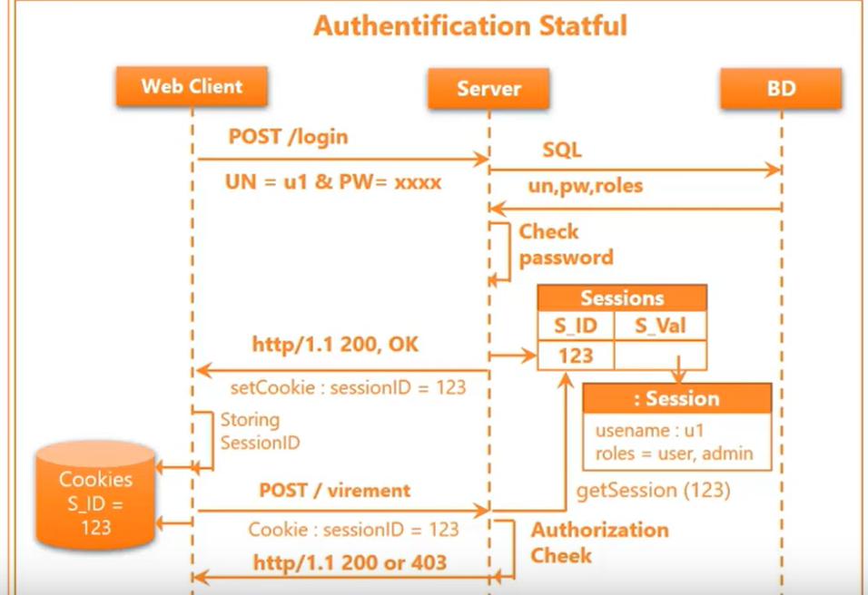
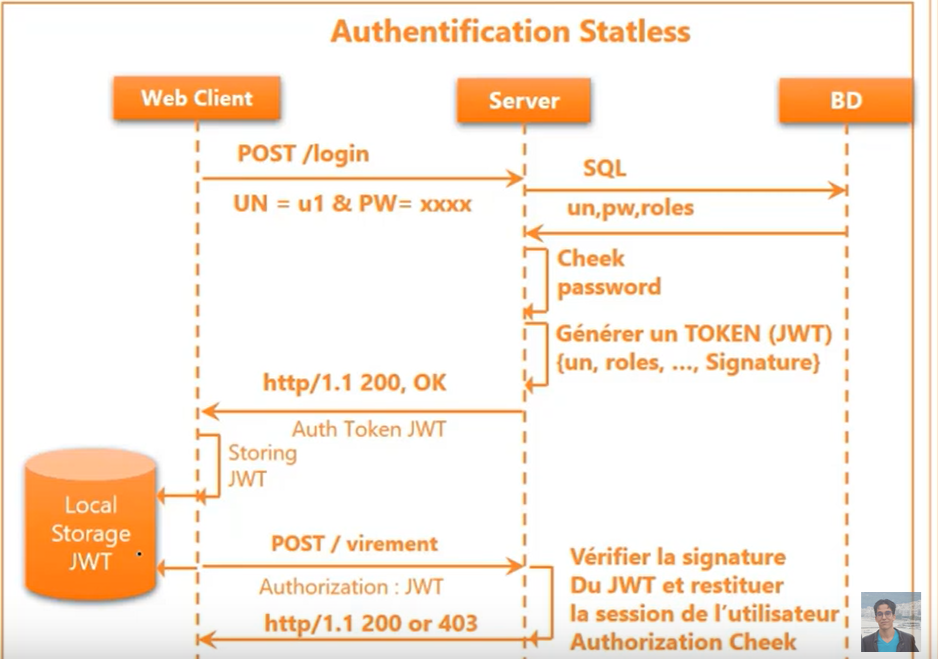

# Spring Security

[Cours youtube](https://www.youtube.com/watch?v=3q3w-RT1sg0&ab_channel=ProfesseurMohamedYOUSSFI)

## Resumer des systèmes d'authentification

### Tableau 1 : Stateful

### Tableau 2 : Stateless

## Faille de sécurité CSRF

### Problème :

### Une solution :

## JWT

## Spring Security

Spring security génère une page d'authentification (en communiquant le mot de passe en console).
Ensuite, il cntourne la faille de sécurité CSRF en mettant en place le jeton de sécurité (d'ou la raison pour laquelle la page est bloquée).

Pour avoir la main sur la configuration (dans le cas ou on utilise une stratégie stateless),
on créé un fichier `SecurityConfiguration` pour personnaliser les paramètres :

`.permitAll()` Pour authoriser toutes URL

`.csrf(...)` Pour désactiver le csrf

`.header(...)` dans lequel se trouve frameOption, qu'il faut désactiver aussi 

